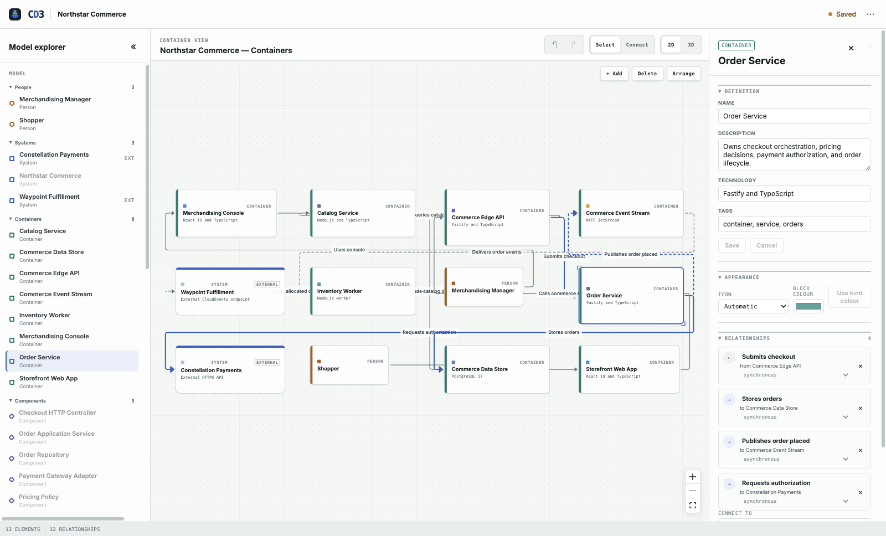
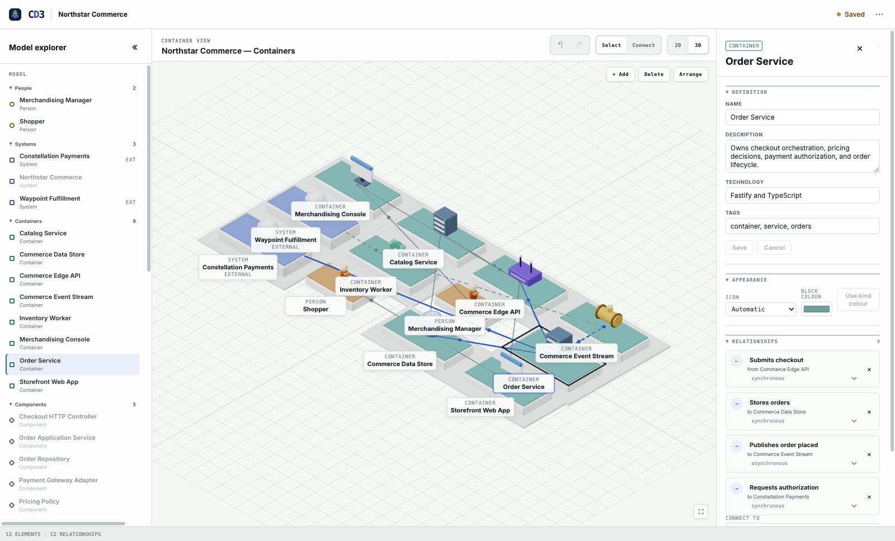

<p align="center">
  
</p>

<h1 align="center">CD3</h1>

<p align="center">
  An independent, local-first C4 architecture editor with synchronized 2D and 3D views.
</p>



One canonical project model drives an editable 2D canvas and a synchronized low-poly 3D view: add,
move, connect, recolour, and delete in either, and every change is one undoable command against the
model. Both views are projections of the same truth — 2D placement stays authoritative, a 3D drag
commits as a 2D move. No cloud, no accounts, no telemetry. Ships with the fictional **Northstar
Commerce** sample.



## Install

**Any platform, one command.** With Node.js 22.12+:

```sh
npx @bbardia/cd3   # opens http://127.0.0.1:6985, projects save to ~/.cd3
```

**Any platform, from source.** Node.js 22.12+ and pnpm 11 (`corepack enable`), then:

```sh
pnpm install && pnpm build && pnpm start   # http://127.0.0.1:6985
```

**Linux.** Download `CD3-<version>.AppImage` (`chmod +x`, then run) or `cd3_<version>_amd64.deb`
from [Releases](https://github.com/Bbardia/CD3/releases).

**macOS.** Download `CD3-<version>-arm64.dmg` from the same place. The build is unsigned, so the
first launch is right-click → Open. Projects live in `~/Library/Application Support/CD3`.

**Windows.** Download `CD3 Setup <version>.exe` from the same place. The build is unsigned, so
SmartScreen warns on first run: **More info → Run anyway**.

Pushing a `v*` tag builds and attaches every package in CI; `pnpm dist:mac`, `pnpm dist:linux`, and
`pnpm dist:win` build the same artifacts locally.

## Host it for a team

CD3 binds to loopback and answers only to loopback until you publish an address. Name the address
people will type, and it serves the whole app — editor and API — from that one port:

```sh
CD3_PUBLIC_ORIGIN=http://cd3.lan:6985 CD3_DATA_DIR=/var/lib/cd3 pnpm start
```

Several names are comma-separated, and `*` accepts any hostname when the address is not fixed. A
published instance still refuses cross-origin mutations, so a page on another site cannot drive it,
and that holds behind a TLS-terminating reverse proxy, where only the scheme differs.

Read the trade-off before you publish one. **CD3 has no accounts.** Everyone who can reach the
address shares one project and may edit or delete it — the revision guard turns simultaneous writes
into an honest conflict rather than silent loss, but it is not access control. Keep a published
instance on a trusted network, or put an authenticating proxy in front of it.

## Work the canvas

Drop a `.c4.json` or a portable project PNG anywhere on the window to open it — the same thing
**Open project…** does from the workspace menu, and what makes a hosted instance useful to someone
who has nothing but the link.

Double-click empty canvas to add at the pointer (elements, regions, notes); double-click an element
to drill into the view scoped to it. Click a relationship line to rename, retype, or delete it.
`V`/`C` switch the Select and Connect tools; **Arrange** lays the view out via ELK as one undoable
move. **Export image (PNG)** captures the active canvas and nothing else; **Portable project PNG**
looks identical but hides the whole project inside the file, so **Open project…** accepts that PNG
back. Regions and notes are per-view decoration, never model elements.

Import a running stack — one system, a container per service (tagged by image so icons resolve),
`depends_on` as relationships, and a ready-made view:

```sh
docker compose config --format json | node scripts/import-compose.mjs my-stack
```

## Automate

The API behind the app is also its scripting surface: read the project, replace it, or apply the
same validated, revision-guarded commands the UI executes — from a terminal, CI, or any other tool.
Full reference: [apps/api/README.md](apps/api/README.md).

## Model

| Kind            | May contain | Example            |
| --------------- | ----------- | ------------------ |
| Person          | —           | Shopper            |
| Software system | Containers  | Northstar Commerce |
| Container       | Components  | Storefront API     |
| Component       | —           | Pricing Engine     |

Relationships are normalized records with synchronous or asynchronous interaction. A view holds at
most one occurrence of an element, and a hidden relationship endpoint projects to its nearest
visible ancestor without losing the underlying relationship. Selection is semantic: the tree, 2D,
and 3D always select the same element. Without WebGL, the 2D workspace stays fully usable.

Out of scope: user accounts and multi-user collaboration, cloud hosting or telemetry, duplicate
occurrences of one element in a view, and Isoflow-compatible files.

## Develop

Requires Node.js 22.12+ (`.node-version`) and pnpm 11 (pinned by `packageManager`; `corepack enable`
provides it).

```sh
pnpm install
pnpm dev     # web on http://127.0.0.1:5173, API on http://127.0.0.1:6985
pnpm check   # format, lint, typecheck, test, build, production smoke check
```

`pnpm build && pnpm start` serves the whole app as one process on `127.0.0.1:6985`. With the API
stopped the editor still saves to the browser, and says so. After changing the domain schema,
regenerate the committed JSON Schema with `pnpm generate:schema`. The app icon is rendered from
[apps/web/public/favicon.svg](apps/web/public/favicon.svg) by `pnpm --filter @cd3/desktop icon`.

| Package         | Purpose                                                   |
| --------------- | --------------------------------------------------------- |
| `@cd3/web`      | React 19 + Vite architecture workspace                    |
| `@cd3/api`      | Fastify server and snapshot store                         |
| `@cd3/desktop`  | Electron shell around the local server                    |
| `@cd3/domain`   | Framework-independent Zod schema and TypeScript types     |
| `@cd3/layout`   | Pure view compiler, renderer projections, and ELK adapter |
| `@cd3/fixtures` | Northstar Commerce and deterministic generated fixtures   |

Edits save to the browser and, when the API runs, to a versioned JSON snapshot with timestamped
history under `apps/api/data/` — or wherever `CD3_DATA_DIR` points. On open, an unsynced browser
recovery wins; otherwise disk wins over the synced browser cache, and the bundled sample is the
final fallback. Never commit `.env` files, project data, or backups — `data/` and `release/` are
ignored by Git.

## Credits

The C4 model — context, container, component, code — is the work of
[Simon Brown](https://c4model.com). CD3 is an independent editor for it: not a C4 product, and not
affiliated with its author.

CD3 is an original implementation: it borrows the general idea of synchronized model-driven
architecture views, not code, assets, examples, or visual trade dress from Isoflow or any other
product.
